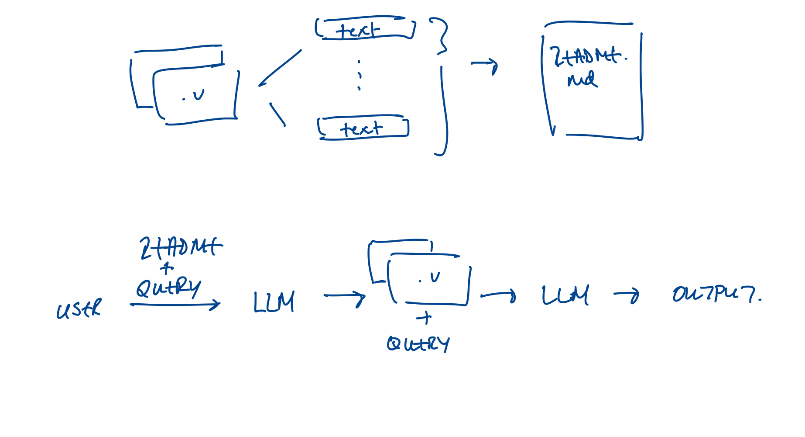

# README: Verilog Documentation Pipeline and LLM Integration

### Candidate Name:

Frank Liu

---

## High-Level Architecture

**Model**: `gpt-4o-mini`

- **Context Window**: 128K
- **Output Tokens**: 16K per request
- **Knowledge Cutoff**: October 2023

---

### Cost Breakdown:

- **$0.150** per 1M input tokens
- **$0.075** per 1M output tokens

---

## Setup:

1. **Documentation Creation**:  
   Create detailed documentation for all Verilog files in the CPU, covering each file's purpose, signals, and inter-module relationships.
2. **README Aggregation**:  
   Aggregate this documentation into a single `README.md` file to serve as the primary context for answering user queries.

## Pipeline:

1. **Query Identification**:  
   When a user asks a question, prepend the contents of the `README.md` to the query and request the LLM to identify the corresponding Verilog file(s) needed for answering the query.

2. **Extract File Information**:  
   Parse the LLM's response to extract the relevant Verilog file(s).

3. **Augmented Query Generation**:  
   Prepend the content of the identified Verilog file(s) to the user query to generate an enhanced query.

4. **Response Generation**:  
   Submit the augmented query to the LLM for the final response.

---

## Reflection on Obstacles / Project Timeline

### 1. **Static Code Indexing (Failed Attempts)**:

- **Regex-Based Metadata Extraction**:  
  Attempted to use regex to extract metadata (module names, parameters, signals). This approach failed due to inconsistent syntax within Verilog files, making the extracted chunks meaningless.
- **Abstract Syntax Tree (AST) via PyVerilog**:  
  PyVerilog was used to generate ASTs and capture syntax rules. However, it failed to recognize complex expressions involving `localparam`, making it unsuitable for comprehensive metadata extraction.

- **Challenges in Module Interaction**:  
  Even with a method to split Verilog code into logical chunks and store it in a vector database, it would still lack metadata describing how modules interact with each other in the codebase.

### 2. **Dynamic Analysis / Simulations (Failed Attempts)**:

- **Simulation Errors**:  
  Encountered multiple issues when attempting to run simulations, primarily related to missing prerequisites and issues in building the simulation directory.

  **Common Problem**:  
  The error encountered was: _"The most common problem people have had is the result of not having the prerequisites properly installed on your computer."_

---

## Ideas for Future Improvements / Extensions

### 1. **Improving Static Code Indexing**:

- By prepending entire Verilog file contents, we preserve order, but risk exceeding the context window for tasks involving multiple files. Finding an optimized balance between file size and token usage is crucial.
- We can process the retrieved files to better understand how the contents of file contribute to answering the question. For instance, "How does the following file contribute to answering the following query? Reference specific snippets of the Verilog file to support your answer". This may help with reducing the amount of tokens we need to allocate for the final response.

### 2. **Supporting Dynamic Analysis**:

- Develop a tool that executes Verilog simulations, aggregates logs, waveforms, and runtime behavior, and integrates them into LLM queries.

### 3. **LLM Reflection, Planning, and Tool Execution**:

- Allow the LLM to create a plan of action, use tools for specific tasks, and reflect on its responses to improve reasoning accuracy.

### 4. **Supporting Conversation History**:

- Enable follow-up questions and clarifications for incomplete or imprecise answers, guiding the LLM towards the desired outcome over multiple interactions.

### 5. **Implementing a Cache for Common Queries (High Risk)**:

- Pre-simulate common runtime scenarios and cache answers to frequently asked questions. This could improve efficiency but comes with the risk of outdated information or incorrect assumptions.

---
